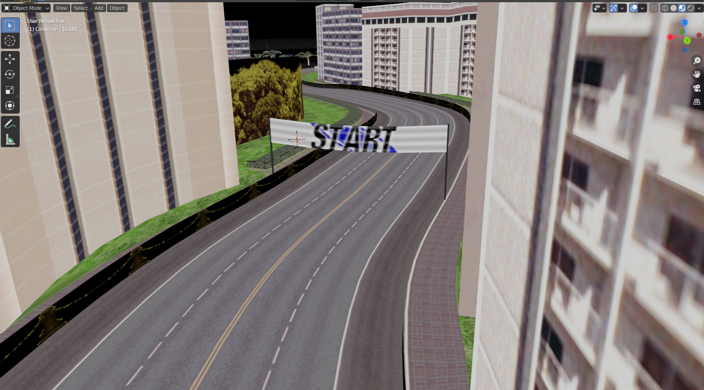

# Test-Drive-5-Mod-Tools
[](https://ci.appveyor.com/project/Dummiesman/test-drive-5-mod-tools/branch/main)



A small set of tools to mod Test Drive 5 and 6. 

What's supported?
|                         | Test Drive 5 | Test Drive 6 |
|-------------------------|--------------|--------------|
| Importing Levels        | ✓            | ✓            |
| Importing Other Objects | ✓            | ✓            |
| Exporting Levels        | x            | x            |
| Exporting Other Objects | ✓            | x            |

### td5unpack
This tool unpacks the models.dat/textures.dat files from levels into formats readable by the Blender add-on

### io_scene_td5
The Blender add-on which can import/export models, and import unpacked levels

To import levels from Test Drive 6, extract the "textureX.zip" (X being the level number) to the levelX\textures folder, so for example you'd have 
```
TD6\levels\level001\models
TD6\levels\level001\textures
TD6\levels\level001\textures\textures.dir
```
